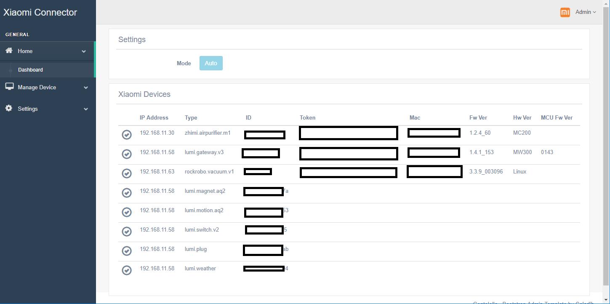
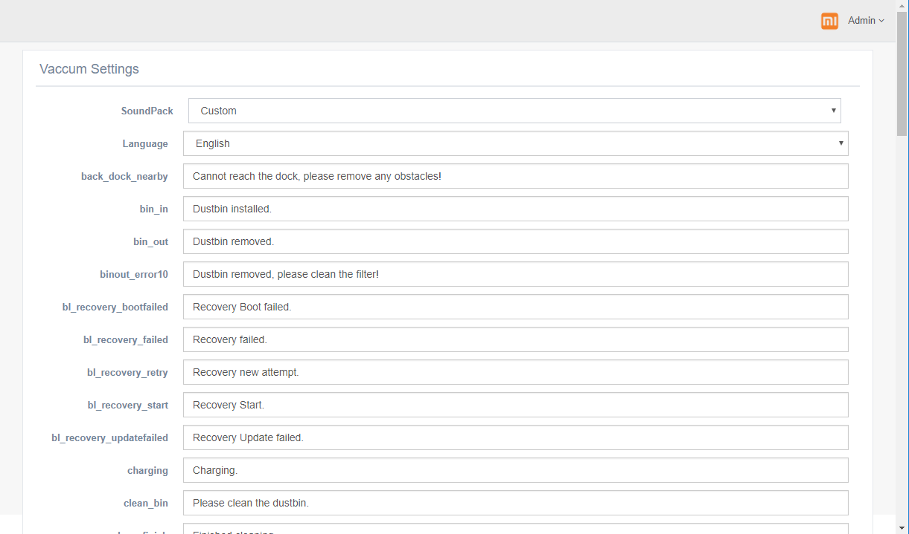
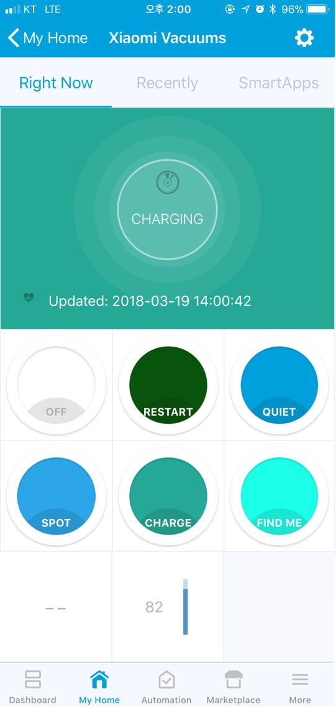
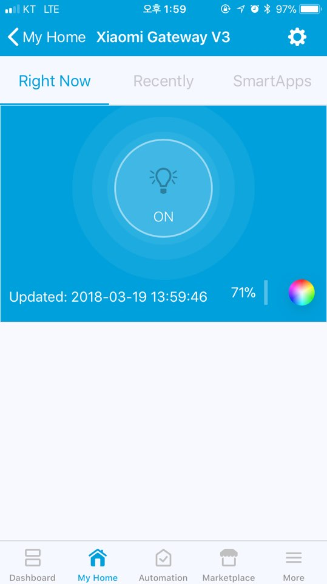

# Mi-Connector
Connector for Xiaomi Devices with ST

This makes you easy to setup xiaomi devices to Smartthings.
  
Example Video 

  

  
Management Web Desktop Version. 
 

 

 

 

 

 

  

Management Web Mobile Version. 
 
 

  
DTH 
Xiaomi Vacuum 
 

Xiaomi Air Purifier 
 

Xiaomi Gateway 
 

# Install API Server 
a. raspberry pi 
&nbsp;&nbsp;sudo mkdir /docker 
&nbsp;&nbsp;sudo mkdir /docker/mi-connector 
&nbsp;&nbsp;sudo chown -R pi:pi /docker 
&nbsp;&nbsp;docker pull fison67/mi-connector-arm:0.0.1 
&nbsp;&nbsp;docker run -d -v /docker/mi-connector:/config --net=host fison67/mi-connector-arm:0.0.1 

b. synology nas 
&nbsp;&nbsp;make folder /docker/mi-connector 
&nbsp;&nbsp;Run Docker 
&nbsp;&nbsp;&nbsp;-> Registery  
&nbsp;&nbsp;&nbsp;-> Search fison67/mi-connector 
&nbsp;&nbsp;&nbsp;-> Advanced Settings 
&nbsp;&nbsp;&nbsp;-> Volume tab -> folder -> Select mi-connector & Mount path '/config' 
&nbsp;&nbsp;&nbsp;-> Network tab -> Check 'use same network as Docker Host' 
&nbsp;&nbsp;&nbsp;-> Complete 

  
 
# Install DTH 
&nbsp;a. Connect to the Smartthings IDE 
&nbsp;b. Click My Device Handlers 
&nbsp;c. Click Create New Device Handlers 
&nbsp;d. Copy content of file in the dth folder to the area 
&nbsp;e. Click Create 
&nbsp;f. Loop 

  

# Install Smartapps 
&nbsp;a. Connect to the Smartthings IDE 
&nbsp;b. Click My Smartapps 
&nbsp;c. Click New Smartapp 
&nbsp;d. Click From Code  
&nbsp;e. Copy content of mi_connector.groovy to area 
&nbsp;f. Click Create 
&nbsp;e. Click My Smartapps & Edit properties (Mi-Connector) 
&nbsp;g. Enable OAuth 
&nbsp;h. Update Click 

  

Support devices 
- xiaomi air purifier 
- xiaomi humidifier 
- xiaomi vacuum 
- xiaomi air monitor 
- xiaomi gateway 
&nbsp;&nbsp;- xiaomi motion sensor 
&nbsp;&nbsp;- xiaomi door/window sensor 
&nbsp;&nbsp;- xiaomi button 
&nbsp;&nbsp;- xiaomi cube 
&nbsp;&nbsp;- xiaomi socket 
&nbsp;&nbsp;- xiaomi weather 

  
# Library
- https://github.com/aholstenson/miio
- https://github.com/zlargon/google-tts

  
# Donation Button

