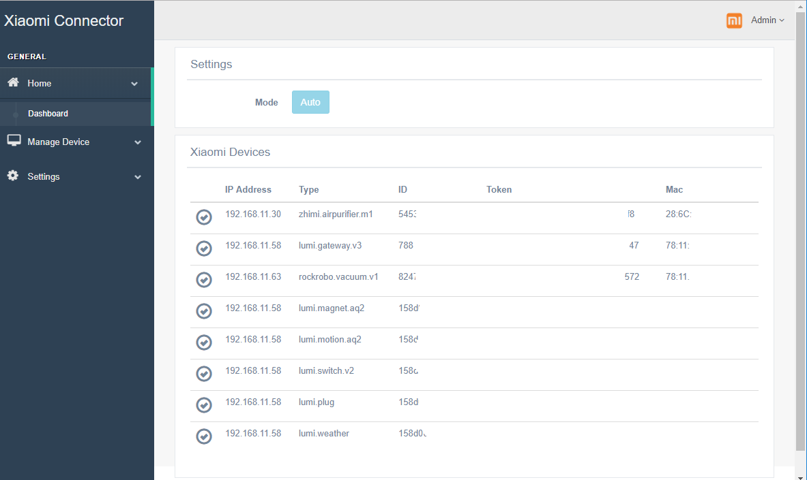

# Mi-Connector
Connector for Xiaomi Devices with ST

This makes you easy to setup xiaomi devices to Smartthings.<br/>
If Mi-Connector is installed, virtual devices is registered automatically by Mi Connector Smartapp.<br/>
You don't have to do something to add xiaomi device in Smartthings IDE.

<br/><br/>
#### Example Video<br/>
[](https://www.youtube.com/watch?v=CtPce-KBVcY)

<br/><br/>


<br/><br/>
## Management Web Desktop Version.<br/>
 


<br/><br/>

## Management Web Mobile Version.<br/>
 


<br/><br/>
## DTH Example<br/>
 


<br/><br/>

# Install
#### Preparing
```
You need a Raspbery pi or Synology Nas to install Mi Connector API Server
```
<br/><br/>

## Install API Server<br/>
a. raspberry pi<br/>
```
sudo mkdir /docker
sudo mkdir /docker/mi-connector
sudo chown -R pi:pi /docker
docker pull fison67/mi-connector-arm:0.0.1
docker run -d -v /docker/mi-connector:/config --net=host fison67/mi-connector-arm:0.0.1
```

b. synology nas<br/>
See the [Install](./doc/install/nas/README) file for details
```
make folder /docker/mi-connector
Run Docker
-> Registery 
-> Search fison67/mi-connector
-> Advanced Settings
-> Volume tab -> folder -> Select mi-connector & Mount path '/config'
-> Network tab -> Check 'use same network as Docker Host'
-> Complete
```
<br/><br/>
 
## Install DTH<br/>
```
Go to the Smartthings IDE
Click My Device Handlers
Click Create New Device Handlers
Copy content of file in the dth folder to the area
Click Create
Loop until all of file is registered
```
<br/><br/>

## Install Smartapps<br/>
```
Connect to the Smartthings IDE
Click My Smartapps
Click New Smartapp
Click From Code 
Copy content of mi_connector.groovy & Paste
Click Create
Click My Smartapps & Edit properties (Mi-Connector)
Enable OAuth
Update Click
```

<br/><br/>

## Support devices<br/>
#### Wi-Fi Version
| Type  | Model | Tested |
| ------------- | ------------- | ------------- |
| Xiaomi air purifier  | zhimi.airpurifier.m1  |   O |
|   | zhimi.airpurifier.v1  |   X |
|   | zhimi.airpurifier.v2  |   X |
|   | zhimi.airpurifier.v3  |   X |
|   | zhimi.airpurifier.v6  |   X |
|   | zhimi.airpurifier.ma2  |   X |
| Xiaomi humidifier  | zhimi.humidifier.v1  |   X |
| Xiaomi vacuum  | rockrobo.vacuum.v1  |   O |
|   | roborock.vacuum.s5  |   X |
| Xiaomi Power Socket  | chuangmi.plug.v1  |   X |
|   | chuangmi.plug.v2  |   X |
|   | chuangmi.plug.m1  |   X |
| Xiaomi air monitor  | zhimi.airmonitor.v1  |   X |
| Xiaomi gateway  | lumi.gateway.v2  |   X |
|   | lumi.gateway.v3  |   O |

#### Zigbee Version
| Type  | Model | Tested |
| ------------- | ------------- | ------------- |
| Xiaomi motion sensor | lumi.motion  |  X  |
|  | lumi.motion.aq2  |  O  |
| Xiaomi door/window sensor | lumi.magnet  |  X  |
|  | lumi.magnet.aq2  |  O  |
| Xiaomi weather sensor | lumi.weather  |  O  |
| Xiaomi power socket | lumi.plug  |  O  |
| Xiaomi Button | lumi.switch  |  X  |
|  | lumi.switch.v2  |  O  |
|  | lumi.86sw1  |  X  |
|  | lumi.86sw2  |  X  |
| Xiaomi Cube | lumi.cube  |  X  |


<br/><br/>
## Library
- https://github.com/aholstenson/miio
- https://github.com/zlargon/google-tts

<br/><br/>
## License

This project is licensed under the MIT License - see the [LICENSE](LICENSE) file for details

<br/><br/>
## Donation Button

[](https://paypal.me/fison67)


